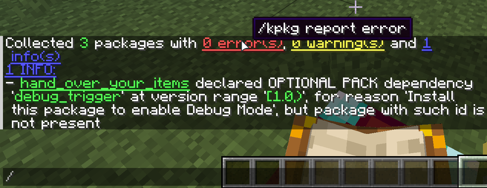
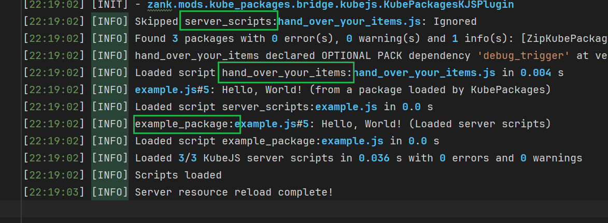
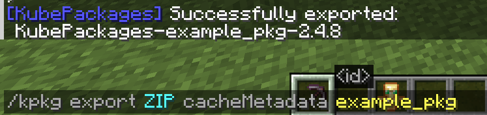

# KubePackages

是为 KubeJS 设计的包管理器。

KubePackages为KubeJS引入了包的概念，重构了KubeJS脚本的传播形式，允许脚本像模块一样封装，像资源包一样加载，像模组一样分发。

本页面会简要介绍KubePackages的精华——KubePackage。更详细的概念介绍与教程参见：

### [WIKI](doc/home.md)

## KubePackage（对的，没有's'）

为了支持包的管理、分发、以及依赖处理，KubePackages引入了KubePackage，作为KubePackages中“包”概念的载体，并在此基础上提供了一套完整的加载框架，让开发者能够以模块化的方式构建、集成和发布 KubeJS 功能，告别传统脚本的扁平化、命名空间污染、以及随之而来的高耦合等问题。

> 你知道吗：Rhino对变量作用域的处理一直以来非常古怪，加上KubeJS自身的扁平化脚本加载，导致变量同名时容易产生难以发现的bug。

KubePackage不仅是脚本包的容器，同时还能提供assets与data的资源内容，并在metadata中携带依赖关系，比资源包加数据包更进一步。

通过 KubePackage，开发者可以不再只是编写脚本并无意识中重新发明轮子，而是借助可复用的功能模块提升开发质量。你可以：

- 像开发模组一样攥写脚本：KubePackage拥有独立的依赖管理与命名空间。
- 像安装模组一样加载功能：借助名为`KubePackages`的JS binding，你可以轻松检查特定包是否存在，集成他人开发的包，进行数据通信与共享，快速构建复杂项目。
- 像发布模组一样分享成果：一键导出为.jar文件/.zip文件/目录，直接将包作为模组发布到 CurseForge 或 Modrinth。

KubePackages 的目标是成为 KubeJS 生态的包管理标准，并为整个社区提供统一的开发范式。

## 画廊

依赖管理，图中`hand_over_your_items`声明了一个可选依赖`debug_trigger`：

命名空间隔离，图中三个命名空间有两个来自于KubePackage，各自声明的变量互相独立，也就是说三个命名空间可以同时声明一个名字都是colors，但内容截然不同的变量：

查看已经加载的KubePackage，每一个条目在点击之后都会提供获取详细信息的命令：

通过命令导出KubePackage。但是作者更建议通过JS脚本导出([export.js](doc/example/export.js))，并通过配置排除用于导出的脚本自身，因为JS脚本可以提供更多控制选项，包括排除特定脚本：
