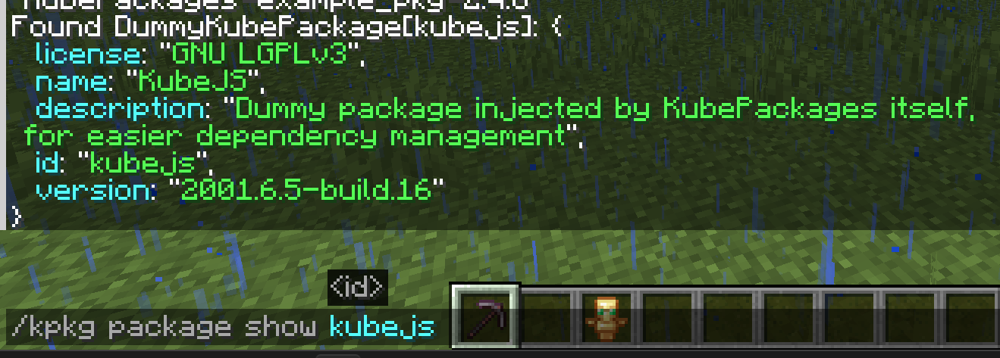

### English(You are here) | [简体中文](./README_zh_cn.md)

# KubePackages

Package manager for KubeJS.

KubePackages introduces the concept of "package" for KubeJS, redefining how scripts are distributed. It allows scripts
to
be encapsulated like modules, loaded like resource packs, and distributed like mods.

This page provides a brief introduction to the core feature of KubePackages: the KubePackage. For more detailed
explanations and tutorials, please refer to:

### [WIKI](doc/home.md)

## KubePackage (Yes, without the 's')

To support package management, distribution, and dependency management, KubePackages introduces "KubePackage" as the
carrier for the "package" concept. It provides a complete loading framework, enabling developers to build, integrate,
and publish KubeJS functionalities in a modular way. This resolves the issue of flattened script
loading, namespace pollution, and tight coupling between scripts.

> Did you know that: Rhino's handling of variable scopes has always been quite peculiar. Combined with KubeJS's
> flattened script loading, declaring variables with same name can easily lead to hard-to-find bugs.

KubePackage is not just a container for script files, but can also provide `assets` and `data` resources. Combined with
metadata with dependency info, KubePackage goes a step further than resource packs and data packs.

With KubePackage, developers can do more than just writing scripts and inadvertently reinventing the wheel. Instead,
they
can leverage reusable modules to improve development QoL. You can:

- **Write scripts like developing mods:** KubePackage provides independent dependency management and script scope.
- **Load functionalities like installing mods:** Using the JS binding named `KubePackages`, you can easily check if
  specific packages exist, integrate packages developed by others, communicate data between packages, and
  quickly build complex projects.
- **Share your work like publishing mods:** Export packages effortlessly as `.jar` files, `.zip` files, or directories,
  and
  publish them directly as mods on CurseForge or Modrinth.

KubePackages aims to become the standard package management system for the KubeJS ecosystem and provide a unified
standard for the entire community.

## Gallery

**Dependency Management:** The image shows `hand_over_your_items` declaring an optional dependency on `debug_trigger`:

**Namespace Isolation:** The image shows three namespaces, two of which come from KubePackages. Variables declared in
each are independent, meaning all three namespaces can declare a variable with the same name `colors` and entirely
different contents:

**Viewing Loaded KubePackages:** Each entry in the list in the list can suggest a command to retrieve detailed
information when clicked:

**Exporting KubePackages via Command:** I recommend exporting via JS
script ([export.js](doc/example/export.js)) and exclude the export script itself through configuration, as JS scripts offer
more control over exporting process, including excluding specific scripts:
